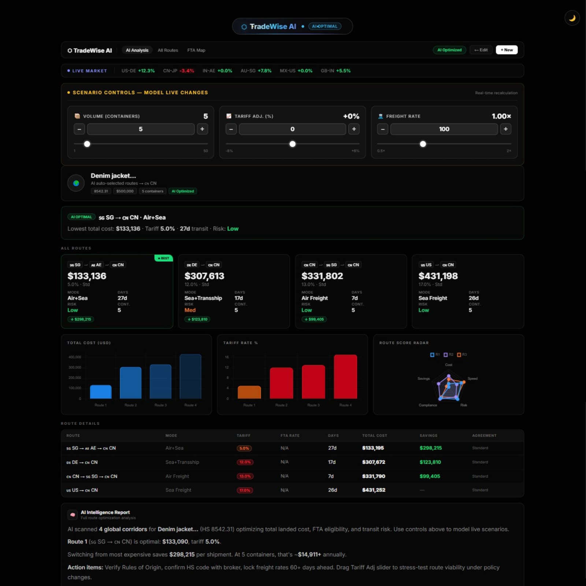
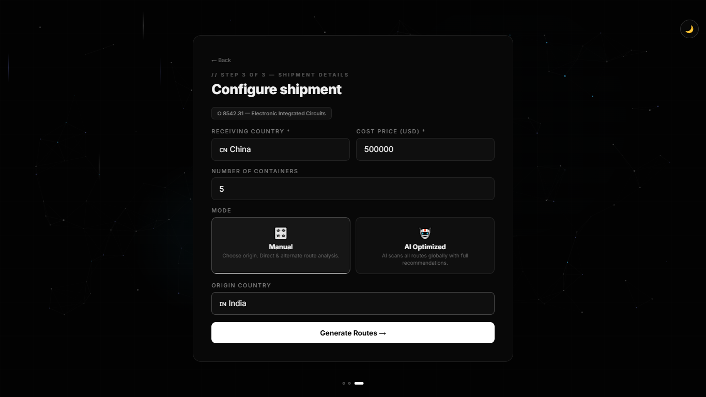
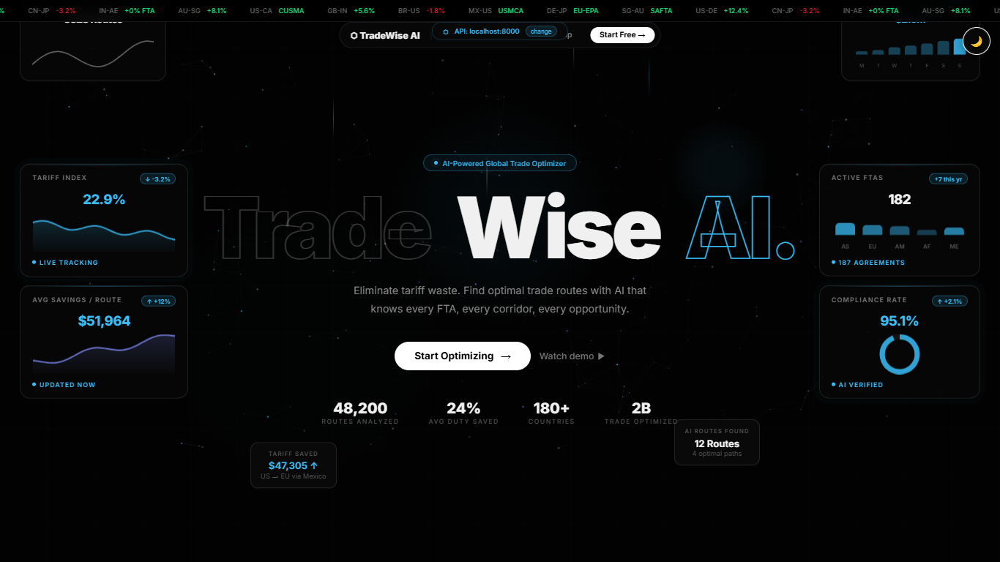
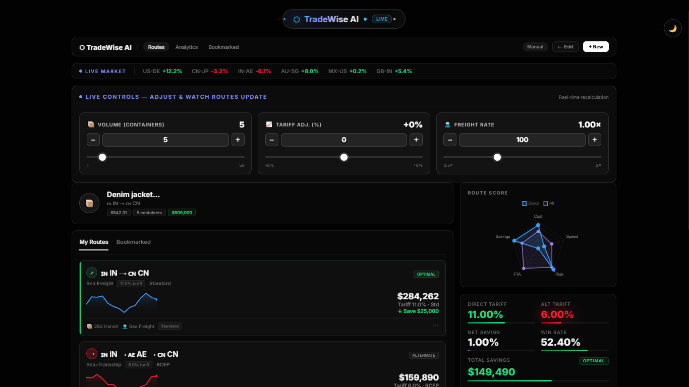

# 🚀 TradeWise AI

## 📌 Overview
TradeWise AI is an AI-powered platform that optimizes global trade routes by analyzing tariffs, freight costs, and supply chain data. It helps businesses identify the most cost-effective and efficient shipping paths using data-driven intelligence.

---

## 🎯 Problem Statement
Global logistics is complex due to:
- Fluctuating tariff policies  
- Dynamic freight pricing  
- Multiple route options  

Businesses often struggle to select the optimal trade route, leading to increased costs and delays.

---

## 💡 Solution
TradeWise AI leverages machine learning and real-time data to:
- Analyze multiple international trade routes  
- Predict cost variations and risks  
- Recommend optimal shipping strategies  

---

## ⚙️ Key Features
- 📊 Intelligent trade route optimization  
- 💰 Cost comparison across multiple routes  
- 🔄 Dynamic rerouting based on real-time data  
- 📈 Decision-support insights for businesses  

---

## 📸 Screenshots

| AI Route | Shipment Config |
|----------|----------------|
|  |  |

| Landing Page | Manual Route |
|-------------|-------------|
|  |  |

---

## 🔧 Tech Stack

**Programming Languages**
- Python  

**Libraries & Frameworks**
- Pandas, NumPy, Scikit-learn  
- Flask / FastAPI  

**Tools**
- Git, GitHub  

**Concepts**
- Machine Learning  
- Route Optimization  
- Data Analysis  

---

## 📊 Results & Impact
- Achieved up to **30% reduction in logistics costs**  
- Improved decision-making efficiency in trade route selection  
- Demonstrated practical application in real-world supply chain scenarios  

---

## 🧠 Machine Learning Approach
- Utilized models such as **Random Forest / Regression**  
- Analyzed datasets including:
  - Tariff structures  
  - Freight pricing  
  - Route distances  
- Focused on minimizing:
  - Cost  
  - Delivery time  

---

## ▶️ How to Run

```bash
# Clone repository
git clone https://github.com/Navdeep223/TradeWiseAI

# Navigate to project directory
cd TradeWiseAI

# Install dependencies
pip install -r requirements.txt

# Run the application
python app.py

---

## 🚀 Future Enhancements
- Integration of deep learning models  
- Real-time global trade API expansion  
- Interactive web dashboard for visualization  
- Advanced predictive analytics  

---

## 🏆 Achievements
- 🥈 Secured **2nd place at Stack Sprint 1.0 Hackathon**  
- Recognized for innovation in AI-driven trade optimization  

---

## 👨‍💻 Contributors
- **Navdeep Sharma**  
- **Pranav Dubey**

---

## ⭐ Support
If you like this project, consider giving it a ⭐ on GitHub!